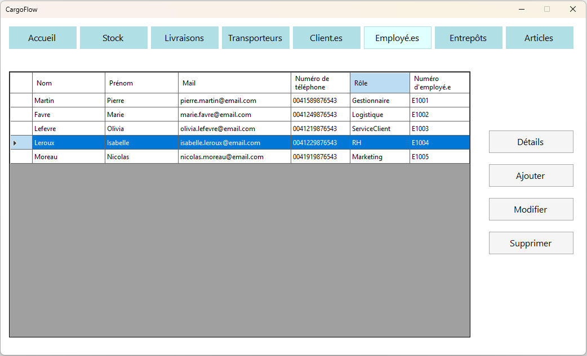
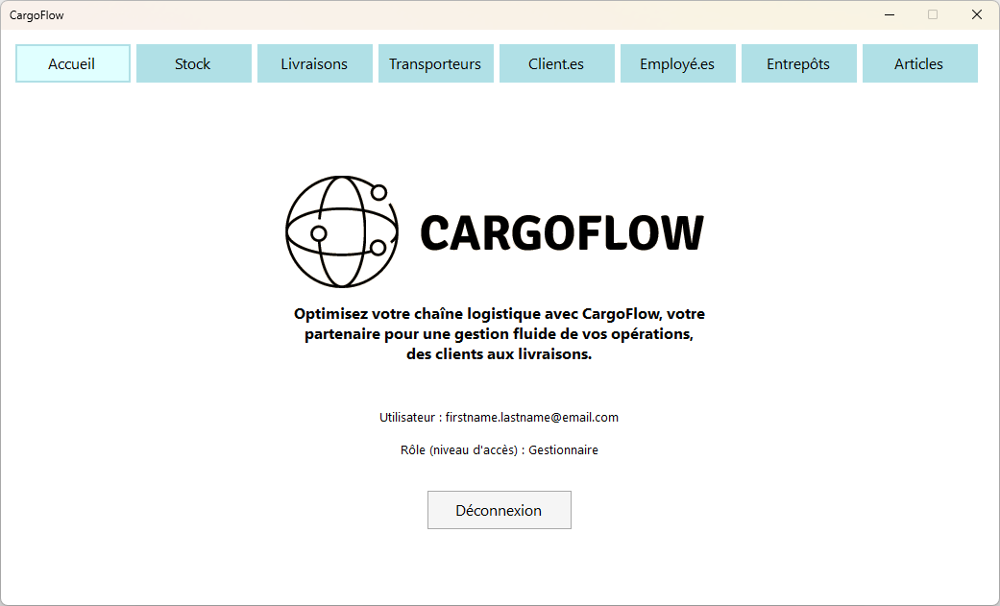

CargoFlow is a Windows Form application designed to manage logistics of a middle-sized company. It includes connection to a local database on a MySQL Server.

It has been made as a student project at CPNV. The intended public of CargoFlow are the employees of a company who need to manage their inventory and deliveries on a small to medium scale.

The data to manage is stored in a local database. CargoFlow offers its users the possibility to make CRUD operations on most of the database tables.

The actual version isn't finished :
- CRUD hasn't been implemented for some entities
- Sorting columns is working as proof-of-concept only for the column Name of the Carriers

# Setup
## Requirements
- Visual Studio
	- Go to https://www.visualstudio.com/downloads
	- Download the Community version
	- Execute VisualStudioSetup.exe
	- Check .NET desktop development and click install
	- Skip Sign in
	- Development settings : Visual C#
- If needed, install .NET 7.0
- MySQL Server (only tested on 8.0.33)
	- Go to https://dev.mysql.com/downloads/mysql/
	- Choose the "MySQL Community Server" for your OS
	- Choose again the "MySQL Community Server" for your OS
	- Don't create an account, chose "No thanks, just start my download"
	- Choose "Custom" for the "Setup type"
	- Choose "MySQL Server 8.0.18 – X64"
	- Click Next until the window "Accounts and Roles"
	- Enter your password, you will use it again in your MySQL Client
	- Check "Configure MySQL Server as a Windows Service" and "Start The MySQL Server at system StartUp"
	- Click Next several times, then Execute, then Next until installation is finished.
- A MySQL Client to execute the .sql file
	- For example with HeidiSQL : download and install with all the default settings
	- Connect with root and your password entered during the MySQL Server installation
	- Open and execute cargoflow_DB.sql with root user
	- Then create a user named "CargoFlow Admin" with "Pa$$w0rd" as the password and give him all the rights on the cargoflow database	

## How to launch
- Execute setup.exe
- If needed, click on Install when the following component appears : ".NET Desktop Runtime 7.0.x"
- When confirmation is asked to install CargoFlowForms, click on Install

# How to use
- Connect as one of the fake users of the database, example :
	- Email : firstname.lastname@email.com ;
	- Mot de passe : flastname
- All the users have the same convention for their password : first letter of first name and full last name 

# Screenshot

